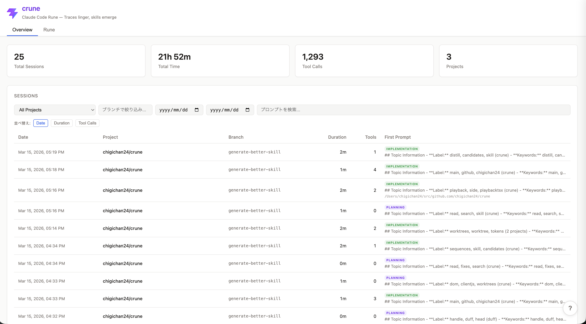
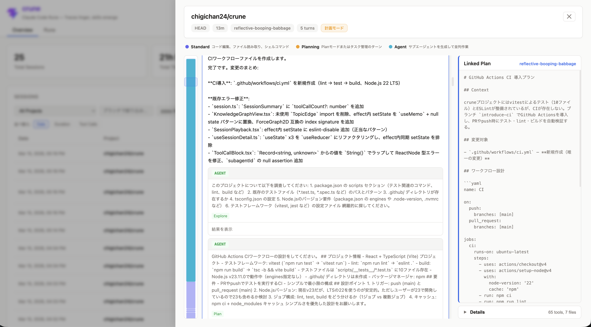
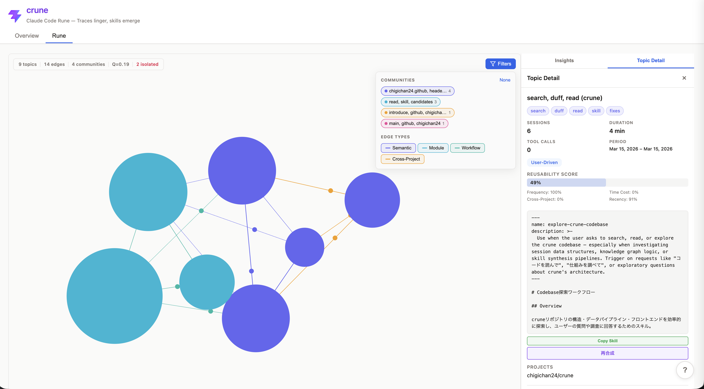

<div align="center">
  
  <h1>crune</h1>
  <p><strong>Claude Code Rune — Traces linger, skills emerge</strong></p>
</div>

Decipher the traces etched in past sessions and resurrect them as reusable skills. crune is a static web dashboard that analyzes Claude Code session logs, providing session playback, analytics, a semantic knowledge graph, and skill synthesis.

## Features

- **Session Playback** --- Turn-by-turn conversation replay with minimap navigation, tool call inspection, and subagent branch expansion
- **Overview Dashboard** --- Activity heatmap, project distribution, tool usage trends, duration distribution, model usage, and top edited files
- **Semantic Knowledge Graph** --- TF-IDF + Tool-IDF + structural features, Truncated SVD, agglomerative clustering, Louvain community detection, Brandes centrality ([algorithm details](docs/knowledge-graph-algorithm.md))
- **Tacit Knowledge** --- Extracted workflow patterns, tool sequences, and pain points (long sessions, hot files)
- **Session Summarization** --- Automatic session summary and classification (no LLM required)
- **Skill Synthesis** --- Synthesize reusable skill definitions from the knowledge graph ([algorithm details](docs/skill-generation-algorithm.md))

### Overview Dashboard



### Session Playback



### Semantic Knowledge Graph (Rune)



## Quick Start

```bash
npm install

# Analyze Claude Code session logs (~/.claude/projects/)
npm run analyze-sessions

# Start dev server
npm run dev
```

## Data Pipeline

`npm run analyze-sessions` reads JSONL session files from `~/.claude/projects/` and outputs structured JSON to `public/data/sessions/`.

```
~/.claude/projects/**/*.jsonl
  -> parse & build turns
  -> extract metadata, subagents, linked plans
  -> session summarization (centrality-based representative prompt, workType classification)
  -> TF-IDF + Tool-IDF + structural features -> Truncated SVD -> agglomerative clustering -> Louvain
  -> skill synthesis (reusability score top-N -> claude -p)
  -> output:
       public/data/sessions/index.json      (session list)
       public/data/sessions/overview.json   (cross-session analytics + knowledge graph)
       public/data/sessions/detail/*.json   (individual session playback data)
```

Custom paths:

```bash
npm run analyze-sessions -- --sessions-dir /path/to/sessions --output-dir /path/to/output
```

## Session Summarization

The session list displays auto-generated summaries, processed entirely locally without LLM.

- **Representative prompt selection**: Selects the most representative prompt from plan mode turns using Jaccard centrality with position weighting
- **workType classification**: Automatically classifies each session into one of four types:
  - `investigation` --- Exploratory, read-heavy sessions
  - `implementation` --- Edit/write-heavy coding sessions
  - `debugging` --- Bash-heavy sessions with edits
  - `planning` --- Plan mode sessions with few tool calls
- **Keyword extraction**: Extracts top keywords from session prompts
- **Scope estimation**: Infers the session scope from the common directory prefix of edited files

## Skill Synthesis

Synthesizes reusable skill definitions from knowledge graph analysis. Follows the [anthropics/skills](https://github.com/anthropics/skills) format.

- **Pre-synthesis**: Automatically synthesizes the top 5 skill candidates via `claude -p` during `analyze-sessions`
- **Instant display**: Synthesized skills are immediately viewable and copyable in the UI
- **On-demand re-synthesis**: The re-synthesis button generates a full version enriched with graph context (connected topics, community, centrality)
- **Local server**: `npm run skill-server` starts the synthesis API server (localhost:3456)

Synthesis options:

```bash
# Specify model (e.g. haiku for speed)
npm run analyze-sessions -- --synthesis-model haiku

# Change number of candidates to synthesize (default: 5)
npm run analyze-sessions -- --synthesis-count 10

# Skip LLM synthesis (graph construction only)
npm run analyze-sessions -- --skip-synthesis
```

## Scripts

| Command | Description |
|---------|-------------|
| `npm run dev` | Start Vite dev server |
| `npm run build` | Type-check + production build |
| `npm run preview` | Preview production build |
| `npm run lint` | Run ESLint |
| `npm run analyze-sessions` | Run data pipeline |
| `npm run skill-server` | Skill synthesis local server (localhost:3456) |
| `npm run dev:full` | skill-server + Vite dev server together |

### Synthesis options for analyze-sessions

| Flag | Description |
|------|-------------|
| `--synthesis-model <model>` | Model to use for synthesis (e.g. `haiku` for speed) |
| `--synthesis-count <n>` | Number of candidates to synthesize (default: 5) |
| `--skip-synthesis` | Skip LLM synthesis |

## Tech Stack

- React 19 + TypeScript 5.9
- Vite 8
- Chart.js + react-chartjs-2
- react-force-graph-2d (d3-force)
- Plain CSS (no CSS-in-JS, no Tailwind)

## Project Structure

```
src/
  components/
    overview/     # Dashboard cards, session list, charts
    playback/     # Session replay, tool call blocks, subagent branches
    knowledge/    # Force graph, node detail, tacit knowledge, skill synthesis
  hooks/          # Data fetching (useSessionIndex, useSessionDetail, useSessionOverview)
  types/          # TypeScript type definitions
scripts/
  analyze-sessions.ts        # JSONL -> JSON pipeline
  session-summarizer.ts      # Session summarization (local NLP)
  skill-synthesizer.ts       # Skill synthesis (claude -p)
  skill-server.ts            # Synthesis HTTP server
  knowledge-graph-builder.ts # Semantic embedding + graph construction
public/
  data/sessions/             # Generated JSON (gitignored)
```

## Prerequisites

- Node.js >= 18
- Claude Code session logs at `~/.claude/projects/`

## License

Apache-2.0 license
